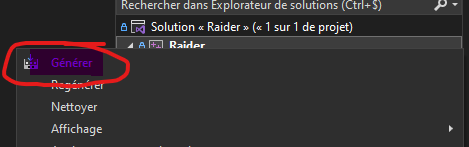

# Raider - Build dll

[Back to main](../main.md)

**⚠️ Before building, make sure that you've installed [dependencies](dependencies.md)**

## Set configuration to Release mode

- Right click on "Raider" 
- Click "Properties" ([image](../assets/Properties.png))
- Click "Configuration Manager" ([image](../assets/Configuration_manager.png))
- Set Raider to Release/x64 ([image](../assets/Configuration_manager_2.png))

To build :

- Open the project with Visual Studio
- Right click on "Raider"
- Click "Generate" or "Build"

**The dll will compile in raider3.5\Raider\bin\Release\Raider.dll**
**⚠️ If you have any compilation error, check [errors](errors.md)**

If the dll compiled successfully, you can now [host your own games](host.md)