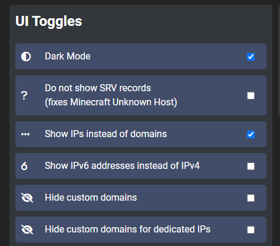
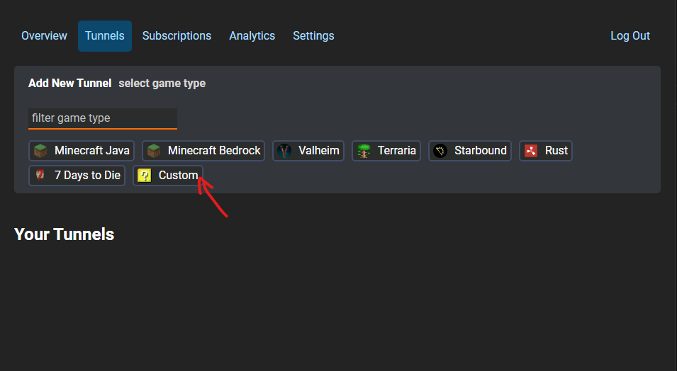
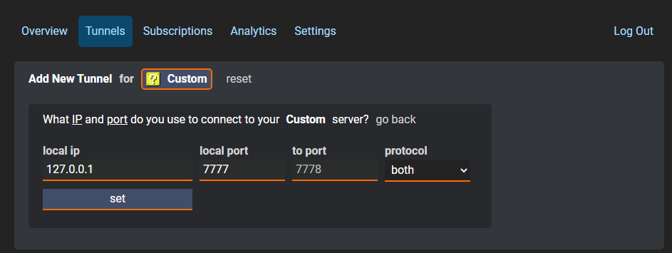
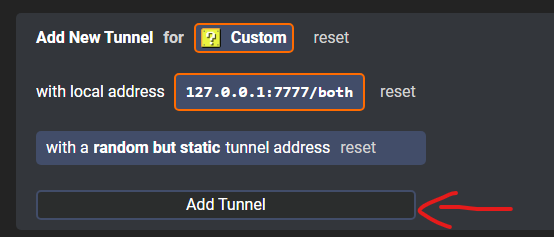
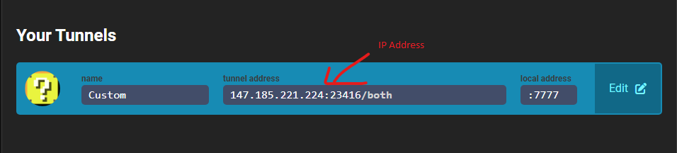

# Raider - Host Without RAdmin

[Back to main](../README.md)

**Requirements**
- [PlayIt](https://playit.gg/downloads/playit-0.8.3-beta-signed.exe)

## Step 0 - Copy these exact settings
**[PlayIt settings](https://playit.gg/account/settings)**
 

## Step 1 - Create a [tunnel](https://playit.gg/account/tunnels)

 

## Step 2 - Configure tunnel

 

## Step 3 - Add tunnel

 

## Step 3 - Copy this IP and send it to your friends

