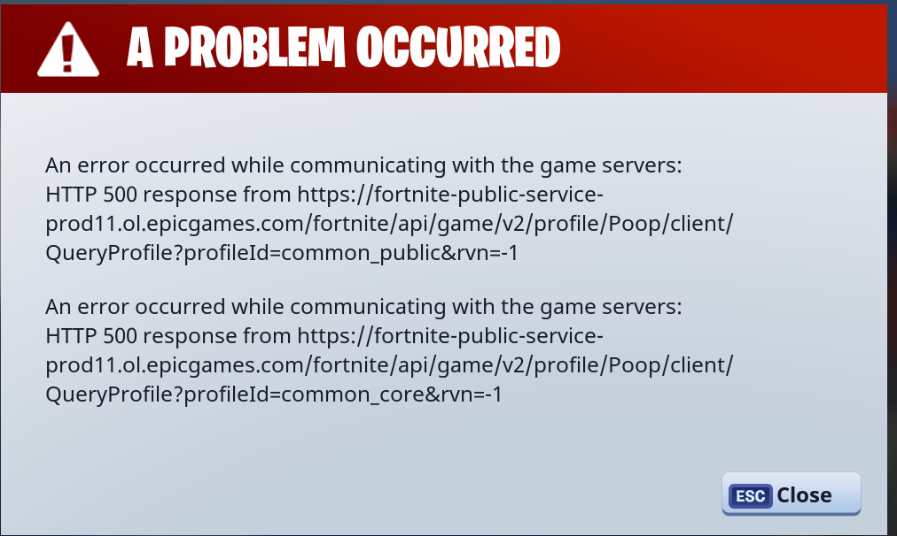
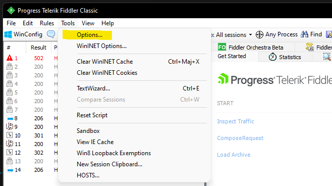
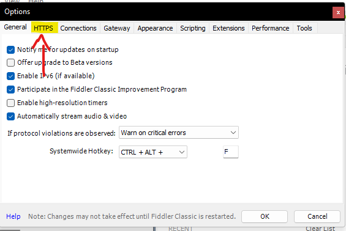
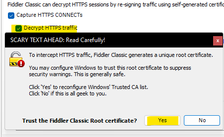
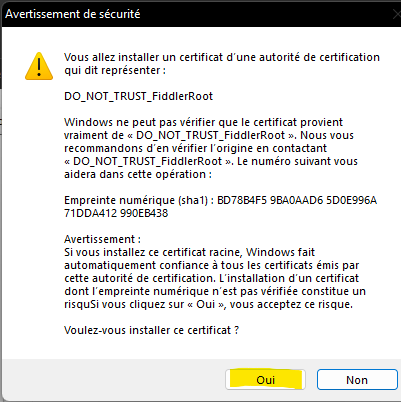
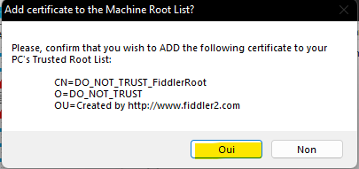
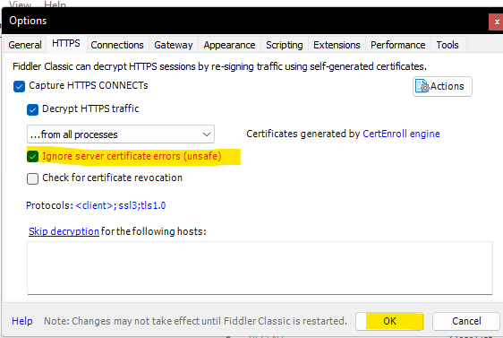
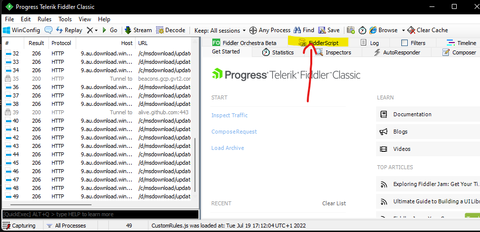

# Raider - HTTP Error 500

[Back to main](../README.md)

## Bug

## Fix : 

### STEP 1 
[Install Fiddler](https://telerik-fiddler.s3.amazonaws.com/fiddler/FiddlerSetup.exe)

### STEP 2

### STEP 3

### STEP 4

### STEP 5

### STEP 6

### STEP 7

### STEP 8

### STEP 9 - Replace the text with [this script](../misc/fiddlerscript.txt)

